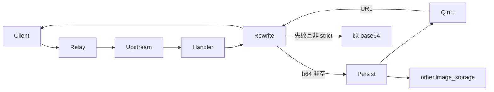

# Phase A：生图 base64 落七牛

## 1. 目标

把 GPT、Gemini 等常见生图引擎返回的 base64 存到自有七牛（S3 兼容），响应用 URL 替换。MJ 的 Discord/官网 CDN 图/视频另给独立开关，SUCCESS 时落盘。见上文需求 1 与 Q1/Q2/Q7/Q9。

做完后：`/v1/images/*`、Responses `image_generation_call`、Gemini chat 的图默认不再把整段 base64 吐给用户；上传失败默认回退原 base64。

## 2. 决策清单

- 协议：S3 兼容。依赖 `github.com/aws/aws-sdk-go-v2/service/s3` 及其 `config`。七牛 Kodo 端点 `s3.<region>.qiniucs.com`，`path_style=true`。
- 配置模块名 `object_storage`，`config.GlobalConfig.Register("object_storage", ...)`。option 键 `object_storage.<field>`。
- 字段与默认值：
  - `enabled` false
  - `provider` `"s3"`
  - `endpoint` `""`
  - `region` `""`
  - `bucket` `""`
  - `access_key` `""`
  - `secret_key` `""`
  - `prefix` `"images"`
  - `public_base_url` `""`（空则走 presign）
  - `presign_ttl_seconds` `3600`
  - `path_style` `true`
  - `image_rewrite_enabled` `false`
  - `gemini_native_rewrite_enabled` `false`
  - `strict_mode` `false`
  - `mj_media_persist_enabled` `false`
  - `upload_timeout_seconds` `30`
  - `max_object_bytes` `52428800`
- 接口：`pkg/objstore.Store` — `Put(ctx context.Context, key, mime string, r io.Reader, size int64) (url string, err error)`。
- 对象键：`{prefix}/{yyyy}/{mm}/{dd}/{userId}/{uuid}.{ext}`。ext 由 mime 推断，默认 `png`。
- 改写范围（a+b+c）：
  - a) `/v1/images/*` 非流式统一缓冲；OpenAI 流式只改 `image_generation.completed` 的 `b64_json`，`partial_image_b64` 不动。
  - b) Responses 非流式改 `output[].result`；流式在 `image_generation_call` completed 时改 `result`。
  - c) Gemini chat 对 content 字符串调 `RewriteMarkdownDataURIs`（host 侧，**不改 relaykit**）。
  - d) Gemini 原生仅当 `gemini_native_rewrite_enabled=true`：`inlineData` → `fileData{mimeType,fileUri}`。
- 失败：回退原 base64 + `common.SysError`；日志 `other.image_storage={persisted,fallback:true}`。`strict_mode=true` 返回 502 且按失败不计费。
- 计费：保持 `data` 数组长度与 `result` 非空。Gemini 原生重写发生在计数之后。
- MJ 媒体：`mj_media_persist_enabled` 默认关。轮询转 SUCCESS 时下载 `image_url`、`video_urls[*].url` 上传并回写。`midjourney` 加 `media_stored` bool（**无** `default` 标签）。`media_stored=true` 不再改写为 `/mj/image/`。失败保留上游 URL。
- 后台：`object-storage-section.tsx` 注册进 integrations。7 个 locale 加键。无需 Casbin。

## 3. 改动清单

顺序：先 `pkg/objstore` + setting + service，再钉 handler，最后前端与 MJ 列。

### server

| 路径 | 新增/修改 | 改什么 | 参照 |
|---|---|---|---|
| `setting/system_setting/object_storage.go` | 新增 | `ObjectStorageSetting` + `init()` `Register("object_storage", ...)` + `GetObjectStorageSetting()` | `setting/system_setting/fetch_setting.go` |
| `pkg/objstore/store.go` | 新增 | `Store` 接口 | — |
| `pkg/objstore/s3store.go` | 新增 | S3 `Put`：path-style、timeout、`max_object_bytes`；公开 URL = `public_base_url` 非空则拼接，否则 presign | aws-sdk-go-v2 s3 |
| `pkg/objstore/factory.go` | 新增 | 按 `enabled`/`provider` 建单例；配置变更后重建 | — |
| `service/image_storage.go` | 新增 | `PersistBase64Image`、`RewriteOpenAIImageJSON`（gjson/sjson `data[*].b64_json`→`url` 并删 `b64_json`）、`RewriteResponsesImageResult`、`RewriteMarkdownDataURIs`、`RewriteGeminiInlineData` | `service/image.go` `DecodeBase64ImageData` |
| `relay/image_handler.go` | 修改 | `ImageHelper`：当 `enabled && image_rewrite_enabled`，用缓冲 `ResponseWriter` 捕获 `DoResponse` 输出 → `RewriteOpenAIImageJSON` → 回写 | 现有 `ImageHelper` |
| `relay/channel/openai/relay_image.go` | 修改 | `image_generation.completed` 事件重写 `b64_json`；`partial_image_b64` 不动 | `openaiImageJSONAsStreamHandler` |
| `relay/channel/openai/relay_responses.go` | 修改 | `OaiResponsesHandler` 非流式重写 `output[].result`；`OaiResponsesStreamHandler` completed 时重写 `result` | `ImageGenerationCallCounter` 之后 |
| `relay/channel/gemini/relay-gemini.go` | 修改 | `GeminiChatHandler` / `GeminiChatStreamHandler` 对 content 调 `RewriteMarkdownDataURIs` | 转换后、写出前 |
| `relay/channel/gemini/relay-gemini-native.go` | 修改 | 仅 `gemini_native_rewrite_enabled` 时 `RewriteGeminiInlineData`，**在** inline 计数之后 | `GeminiTextGenerationHandler` |
| `service/log_info_generate.go` | 修改 | 新增 `attachImageStorageInfo`，嵌 `other.image_storage` | `attachQuotaSaturation` |
| `model/midjourney.go` | 修改 | 加 `MediaStored bool` `json:"media_stored"`，无 default 标签 | 现有 `VideoUrl` |
| `controller/system_task_handlers.go` | 修改 | `runMidjourneyTaskUpdateOnce`：SUCCESS 且开关开则下载上传，成功置 `media_stored=true` | 写 progress 之后 |
| `relay/mjproxy_handler.go` | 修改 | `coverMidjourneyTaskDto`：`media_stored=true` 不改写 `image_url` | `MjForwardUrlEnabled` 分支 |
| `controller` MJ 列表 | 修改 | `GetAllMidjourney` / `GetUserMidjourney` 同样尊重 `media_stored` | 现有转发逻辑 |
| `go.mod` / `go.sum` | 修改 | 增加 `github.com/aws/aws-sdk-go-v2/service/s3` 与 `config` | 已有 bedrock 依赖 |

### 前端

| 路径 | 新增/修改 | 改什么 | 参照 |
|---|---|---|---|
| `web/src/features/system-settings/integrations/object-storage-section.tsx` | 新增 | 表单：开关、endpoint/region/bucket/ak/sk、prefix、public_base_url、ttl、path_style、三个 rewrite/mj/strict 开关 | `worker-settings-section.tsx` |
| `web/src/features/system-settings/integrations/section-registry.tsx` | 修改 | 注册 section `object_storage` | 同文件 worker |
| `web/src/i18n/locales/{en,zh,zh-TW,fr,ru,ja,vi}.json` | 修改 | 英文明文键：`Object Storage`、`Rewrite image base64 to object URLs`、`Persist Midjourney media` 等 | `bun run i18n:sync` |

### SQL

无手写 SQL。`MediaStored` 靠 `AutoMigrate(&Midjourney{})`。布尔列不加 `default:true/false`。完成前三库验证（见下）。

不改 `relaykit/`。

## 数据流

## 三库迁移验证（实施时，本轮不跑）

`midjourney.media_stored` 必须在 SQLite、MySQL >= 5.7.8、PostgreSQL >= 9.6 上：

- 空库启动 `InitDB` 两次，证明幂等
- 用当前已有 `shu_api` 升一次，确认旧行 `media_stored` 为 false/0，索引与唯一约束不变
- 记录引擎版本、命令、结果；跑不了标 BLOCKED，不得声称库兼容完成

## 自测清单（用户）

- `image_rewrite_enabled=false`：响应与现在完全一致
- OpenAI `/v1/images/generations` `response_format=b64_json`：`data[].url` 为七牛/CDN，无 `b64_json`
- 同接口流式：completed 事件已替换，partial 仍是 base64
- Responses `image_generation`：`result` 为 URL 且仍计 1 次 tool
- Gemini chat / nano-banana：markdown 里是 `https://...` 不是 `data:`
- 故意填错 SK：默认仍返回图（base64），后台 SysError；`strict_mode=true` 返回 502 且不扣费
- MJ 开关关：行为不变；打开后 SUCCESS 任务 `image_url` 变永久 URL，失败任务仍是 Discord URL
