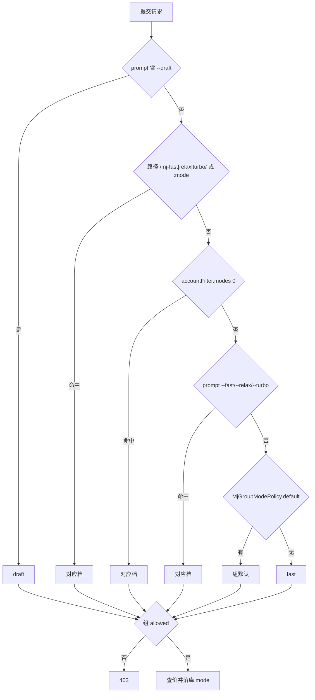
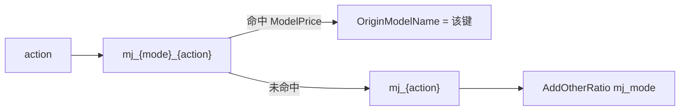

# Phase B：Midjourney 快慢速分账与新功能

## 1. 目标

MJ 按 Relax / Fast / Turbo / Draft 分别计费，并全量对齐 trueai-org/midjourney-proxy v11.x。见上文需求 2 与 Q3/Q4/Q5/Q6。

做完后：同一 `mj_imagine` 在不同模式下可以不同价；分组可限制只允许某些模式；缺的 retexture / video-swap / cancel / notify / 视频代理等端点可用。

## 2. 决策清单

- `midjourney` 表加 `mode varchar(16)`，取值 `fast|relax|turbo|draft`，旧数据空串。
- 判定函数：`service/midjourney_mode.go` `ResolveMjMode(c *gin.Context, req *dto.MidjourneyRequest) (mode string, source string)`。
- 优先级：
  1. prompt 含 `--draft` → `draft`（source=`draft_flag`）
  2. 路径含 `/mj-fast|relax|turbo/`，或 `/:mode/mj` 的 `c.Param("mode")` 规范化后命中三档
  3. `accountFilter.modes[0]`（`FAST|RELAX|TURBO`，大小写不敏感）
  4. prompt `--fast|--relax|--turbo`
  5. `MjGroupModePolicy[usingGroup].default`
  6. `fast`
- 组策略 option `MjGroupModePolicy` JSON：`{"<group>":{"allowed":["fast","relax","turbo","draft"],"default":"fast"}}`。按 **UsingGroup** 匹配。不在 `allowed` → HTTP 403，消息：`midjourney mode <mode> is not allowed for group <group>, allowed: [...]`。未配置的组全部允许。
- 上游传递 option `MjModePathPrefixEnabled` 默认 `true`：`getMjRequestPath` 把上游路径改为 `/mj-{mode}/mj/...`（仅 fast/relax/turbo）。draft 靠 prompt 自带 `--draft`。`MjModeClearEnabled` 与之并存（开了会剥 speed 旗标，不要和 path prefix 同时对同一请求剥光）。
- 查价 option `MjModeRatio` JSON 默认 `{"fast":1,"relax":1,"turbo":2,"draft":0.5}`。
  1. 先查 `ModelPrice` 键 `mj_{mode}_{action}`（例 `mj_relax_imagine`）；`SWAP_FACE` → `swap_face` 的分模式键为 `mj_{mode}_swap_face`。
  2. 命中则 `info.OriginModelName` 改为该键。
  3. 未命中用原 `mj_{action}`，并 `PriceData.AddOtherRatio("mj_mode", MjModeRatio[mode])`。
- **不**把 `mj_{mode}_{action}` 加入 `/v1/models`（默认）。
- 扣费仍在提交成功时一次扣完。轮询到上游 `properties.finalPrompt` / 顶层 `mode` 与落库 `mode` 不一致：`SysLog`，不重算、不补扣、不退差。
- 日志 `GenerateMjOtherInfo` 加 `mj_mode`、`mj_mode_ratio`、`mj_mode_source`。
- 新端点 / 动作：

| 路径 | RelayMode 常量 | action | 模型名 | 默认价 | 计费 |
|---|---|---|---|---|---|
| `POST /mj/submit/retexture` | `RelayModeMidjourneyRetexture` | `RETEXTURE` | `mj_retexture` | 0.1 | 按次 |
| `POST /mj/submit/edit` | 与 edits 相同 | `EDITS` | `mj_edits` | 0.1 | 别名 |
| `POST /mj/task/:id/cancel` | 新 mode 或透传 | — | — | — | 不计费；校验任务归属后透传 |
| `POST /mj/task/list-by-ids` | 透传 | — | — | — | 不计费；过滤非本用户 id |
| `POST /mj/insight-face/video-swap` | `RelayModeSwapVideoFace` | `SWAP_VIDEO_FACE` | `swap_video_face` | 0.1 | 按次 |
| `POST /mj/notify` | 已有 `RelayModeMidjourneyNotify` | — | — | — | 注册路由；受 `MjNotifyEnabled` 门控 |
| `GET /mj/video/:id` | — | — | — | — | 代理 `VideoUrl` 或 `video_urls[0]` |
| `GET /mj/video/:id/:index` | — | — | — | — | 代理 `video_urls[index]`；SSRF 同 `RelayMidjourneyImage` |

- video：`action:"extend"` 必须带 `taskId` + `index ∈ [0,3]`，缺则 400。i2v 无 `taskId` 允许。两者都按 `mj_video`（再套 mode）计费。
- `CoverPlusActionToNormalAction` 增：`video|animate` → `VIDEO`，`retexture` → `RETEXTURE`，`edit` → `EDITS`。
- `change` / `simple-change` **保留不动**。
- 前端绘图设置加 `MjModeRatio` 四个数字、`MjGroupModePolicy` 编辑器、`MjModePathPrefixEnabled` 开关。
- 绘图日志加 `mode` 列与视频预览列。`MJ_TASK_TYPE_MAPPINGS` 补 `MODAL`、`RETEXTURE`、`SWAP_VIDEO_FACE`。
- `GET /api/mj/`、`GET /api/mj/self` 返回体加 `mode`、`video_url`、`video_urls`。

## 3. 改动清单

顺序：常量/表 → 模式解析 → 路由 → 查价 → 轮询/代理 → 前端。

### server

| 路径 | 新增/修改 | 改什么 | 参照 |
|---|---|---|---|
| `constant/midjourney.go` | 修改 | 加 `MjActionRetexture="RETEXTURE"`、`MjActionSwapVideoFace="SWAP_VIDEO_FACE"`；`MidjourneyModel2Action` 加 `mj_retexture`、`swap_video_face` | 同文件现有常量 |
| `relay/constant/relay_mode.go` | 修改 | 加 `RelayModeMidjourneyRetexture`、`RelayModeSwapVideoFace`；`Path2RelayModeMidjourney` 加 suffix | 现有 video/edits |
| `model/midjourney.go` | 修改 | 加 `Mode string` `gorm:"type:varchar(16)" json:"mode"` | 现有 `Action` |
| `setting/midjourney.go` | 修改 | 加 `MjModePathPrefixEnabled`、`MjModeRatio`、`MjGroupModePolicy` 的 get/set/JSON | 现有 `MjModeClearEnabled` |
| `model/option.go` | 修改 | `InitOptionMap` / `updateOptionMap` 挂上三个新 option | 现有 `MjForwardUrlEnabled` |
| `service/midjourney_mode.go` | 新增 | `ResolveMjMode`、`NormalizeMjMode`、`CheckMjModeAllowed` | — |
| `service` CoverPlus | 修改 | `CoverPlusActionToNormalAction` 三组映射 | 现有 upsample 分支 |
| `relay/mjproxy_handler.go` | 修改 | 提交入口调 `ResolveMjMode` + 403；`getMjRequestPath` 按 `MjModePathPrefixEnabled` 改写；注册 video 代理 `RelayMidjourneyVideo` | `getMjRequestPath`、`RelayMidjourneyImage` |
| `router/relay-router.go` | 修改 | `registerMjRouterGroup` 加 retexture/edit/cancel/list-by-ids/video-swap/notify/video 路由；`/mj/image` 与 `/mj/video` 仍在 TokenAuth 前 | 现有 video/edits |
| `controller/relay.go` | 修改 | `RelayMidjourney` 分发新 RelayMode | 现有 switch |
| `relay/helper/price.go` | 修改 | MJ 按次：先查 `mj_{mode}_{action}`，否则 `AddOtherRatio("mj_mode", ...)` | `ModelPriceHelperPerCall` |
| `setting/ratio_setting/model_ratio.go` | 修改 | `defaultModelPrice` 加 `mj_retexture=0.1`、`swap_video_face=0.1` | 现有 `mj_edits` |
| `service/log_info_generate.go` | 修改 | `GenerateMjOtherInfo` 写 `mj_mode` / `mj_mode_ratio` / `mj_mode_source` | 现有 `model_price` |
| `controller/system_task_handlers.go` | 修改 | 轮询对比上游 mode/`finalPrompt`，不一致只 `SysLog` | `runMidjourneyTaskUpdateOnce` |
| `controller` MJ 列表 | 修改 | DTO 带出 `mode`、`video_url`、`video_urls` | `GetAllMidjourney` |
| `dto/midjourney.go` | 修改 | `MidjourneyDto` 如缺则补 `Mode`；`MidjourneyRequest` 可不加字段（多余 JSON 已透传） | 现有 `VideoUrls` |

### 前端

| 路径 | 新增/修改 | 改什么 | 参照 |
|---|---|---|---|
| `web/src/features/system-settings/content/drawing-settings-section.tsx` | 修改 | 四个倍率输入、组策略 JSON/可视化编辑、path prefix 开关 | 现有六个 MJ 开关 |
| `web/src/features/usage-logs/constants.ts` | 修改 | `MJ_TASK_TYPE_MAPPINGS` 补 `MODAL`、`RETEXTURE`、`SWAP_VIDEO_FACE` | 现有 `VIDEO` |
| `web/src/features/usage-logs` 绘图表格 | 修改 | 加 `mode` 列、视频预览列 | 现有 image 列 |
| `web/src/i18n/locales/*.json` | 修改 | `Speed mode`、`Mode ratio`、`Group mode policy` 等 | `bun run i18n:sync` |

### SQL

无手写 SQL。`mode varchar(16)` 靠 AutoMigrate。三库：空库两次 + 旧库升级，旧行 `mode=""`。

## 模式判定

## 查价

## 与 trueai v11.x 的差异（做完后仍保留）

- 本网关继续提供 `change` / `simple-change`（trueai v11.6+ 已移除，改走 action）。
- Draft 不是路径前缀，只认 `--draft`。
- V8 官方不支持 Turbo：本网关仍接受 `turbo` 计价；实际上游若回退 Fast，轮询不重算。
- 不实现 `/mj/profile/create`、admin account 系列、omni 专用动作（V8 已被 Edit Model 取代）。
- 不锁定某个 midjourney-proxy 小版本号；路径与字段按 v11.11.x Swagger。

## 自测清单（用户）

- `/mj/submit/imagine` 无旗标：按 fast、价 = `mj_imagine` × 1
- prompt `--relax` 或路径 `/mj-relax/mj/submit/imagine`：价 = `mj_relax_imagine`（若配置）否则 `mj_imagine` × `MjModeRatio.relax`
- 组策略只允许 `relax`：发 fast → 403
- `--draft` 优先于路径 `/mj-fast/`
- `POST /mj/submit/video` 无 taskId：i2v 成功；`action=extend` 缺 index → 400
- `GET /mj/video/:id/0` 能拉到 mp4
- 绘图日志能看到 mode 与视频
- `change` / `simple-change` 行为与现在一致
