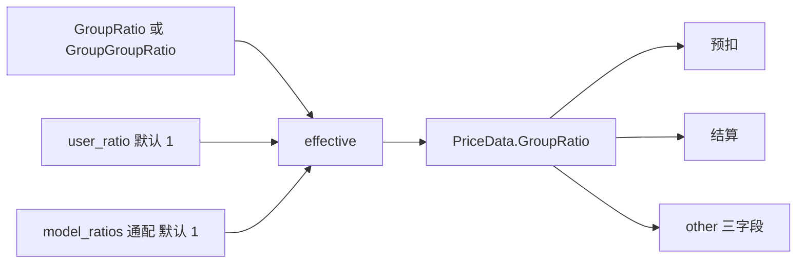

# Phase C：用户级计费覆盖

## 1. 目标

编辑用户弹窗增加：额外绑定多个分组、按模型单独降价、用户级倍率。见上文 Q6 之后的补充需求与 Q10/Q11/Q12。

做完后：某用户可在主组之外再选组开令牌；最终额度 = 现有分组倍率 × `user_ratio` × 该模型折扣；管理员单独一张 profile API，不扩 `EditWithTx`。

## 2. 决策清单

- 存储：新表 `user_billing_profiles`，**不**改 `User` 结构、**不**扩 `EditWithTx`。
- 列：
  - `user_id` int，主键
  - `extra_groups` text，JSON `[]string`
  - `model_ratios` text，JSON `map[string]float64`
  - `user_ratio` float64，**0 视为未设 = 1**，**无** GORM `default` 标签
  - `updated_at` bigint
- 类型：`types.UserBillingProfile{ExtraGroups []string; ModelRatios map[string]float64; UserRatio float64}`
- 模型文件：`model/user_billing_profile.go`，加入 `model/main.go` `AutoMigrate`。
- 缓存：`UserBase` 加 `BillingProfile string`（JSON）；`userCacheSchemaVersion` `2` → `3`；`writeUserCache` Lua HSET 与 `ToBaseUser` 同步写该字段；`WriteContext` 写 key `user_billing_profile`；`RelayInfo` 加 `UserBillingProfile *types.UserBillingProfile`。
- 额外分组语义（个人附加可用组）：
  - `extra_groups` 并入该用户可用组表。
  - 条目必须 ∈ `GroupRatio` 键，否则忽略。
  - 上限 20。
  - 主组 `group` 不变，仍是默认组，仍是 `GroupGroupRatio` 的**外层 key**。
  - 令牌可选 extra 中的组或放进 `auto_groups`；选中哪个组就按哪个组选渠道、算分组倍率。
- 新函数：`service.GetUserUsableGroupsForUser(userGroup string, extra []string) map[string]string`。替换 TokenAuth、`GetUserGroups`、token 创建/更新校验、playground 覆盖、`FilterUserTokenAutoGroups` 的调用点。
- 倍率公式（精确优先，模型名走 `ratio_setting` 现有通配）：

```
effective = groupRatio × userRatio × modelRatio(model)
```

  - `userRatio`：`user_ratio==0` → 1
  - `modelRatio(model)`：`model_ratios` 通配匹配，未命中 → 1
- `HandleGroupRatio` 把 `effective` 写入 `GroupRatioInfo.GroupRatio`；新增字段 `BaseGroupRatio`、`UserRatio`、`UserModelRatio`。
- 同步套用：`service/quota.go` `PreWssConsumeQuota`、`service/task_billing.go`（任务补扣目前两边都用 `task.Group`，叠加 user/model 因子时读任务所属用户的 profile）。
- 日志：`GenerateTextOtherInfo` / `GenerateMjOtherInfo` / 任务 other，仅当对应因子 ≠ 1 时写 `base_group_ratio`、`user_ratio`、`user_model_ratio`。
- `GET /api/user/self/groups` 展示倍率再乘 `user_ratio`（默认）。
- API（`RootAuth`，无 Casbin）：
  - `GET /api/user/:id/billing_profile`
  - `PUT /api/user/:id/billing_profile`
  - 控制器：`controller/user_billing_profile.go`
- 校验：
  - `user_ratio ∈ (0, 100]`（缺省/0 按 1 存或按「未设」读）
  - `model_ratios` 每个值 `∈ (0, 100]`
  - 规则条数 ≤ 200
  - `extra_groups` ≤ 20 且 ⊂ `GroupRatio` 键
- PUT：upsert + 刷新用户缓存（升 schema 字段，不强制撤会话，除非执行者判断组权限变化需要升 `AuthVersion`——默认**升 AuthVersion 并撤会话**，避免旧 token 仍按旧可用组选渠）。
- 前端：`users-mutate-drawer.tsx` 新增区块「计费覆盖」：额外分组多选（`GET /api/group/` 去掉当前主组）、用户倍率数字、模型倍率可编辑表。独立 `getUserBillingProfile` / `updateUserBillingProfile`；主表 `PUT /api/user/` 成功后再 PUT profile。`user-form.ts` zod 加可选字段。

## 3. 改动清单

顺序：表/类型 → 缓存 → 可用组 → HandleGroupRatio → API → 前端。

### SQL / model

无手写 SQL。新表靠 AutoMigrate。三库：空库两次 + 旧库升级后 `users` 行数不变、无 profile 的用户按倍率 1 / 无 extra。

| 路径 | 新增/修改 | 改什么 | 参照 |
|---|---|---|---|
| `model/user_billing_profile.go` | 新增 | struct + `GetUserBillingProfile` / `UpsertUserBillingProfile` | `model/user.go` 风格 |
| `model/main.go` | 修改 | `AutoMigrate` 加入 `&UserBillingProfile{}` | 现有 `&User{}` 旁 |
| `types/user_billing_profile.go` | 新增 | 公开 DTO，避免 service↔relay 循环 | `types/task_artifact.go` |

### server

| 路径 | 新增/修改 | 改什么 | 参照 |
|---|---|---|---|
| `model/user_cache.go` | 修改 | `UserBase.BillingProfile`；schema 2→3；`ToBaseUser` 填 JSON | `Setting` 字段 |
| `model/user_auth_cache.go` | 修改 | `writeUserCache` HSET 加 `BillingProfile` | 现有字段列表 |
| `middleware/auth.go` | 修改 | `WriteContext` 后 TokenAuth 用 `GetUserUsableGroupsForUser`；token.group 校验走新函数 | `GroupInUserUsableGroups` |
| `service/group.go` | 修改 | 新增 `GetUserUsableGroupsForUser`；内部复用现有加减逻辑再并 extra | `GetUserUsableGroups` |
| `controller/group.go` | 修改 | `GetUserGroups` / self/groups 读 profile | `GetUserUsableGroups` 调用点 |
| `relay/common/relay_info.go` | 修改 | 加 `UserBillingProfile`；`genBaseRelayInfo` 从 context 反序列化 | `UserSetting` |
| `relay/helper/price.go` | 修改 | `HandleGroupRatio` 乘 user/model 因子，填 `BaseGroupRatio` 等 | `GroupRatioInfo` |
| `types` PriceData | 修改 | `GroupRatioInfo` 三字段 | 现有 `HasSpecialRatio` |
| `service/quota.go` | 修改 | `PreWssConsumeQuota` 同步乘因子 | 现有 `GetGroupGroupRatio` |
| `service/task_billing.go` | 修改 | 补扣乘同一套因子 | 现有 `GetGroupGroupRatio(group, group)` |
| `service/log_info_generate.go` | 修改 | 因子 ≠1 时写三个 other 字段 | `user_group_ratio` |
| `controller/user_billing_profile.go` | 新增 | GET/PUT + 校验 + upsert + 刷缓存 | `UpdateUser` 的 Root 风格 |
| `router/api-router.go` | 修改 | `GET|PUT /api/user/:id/billing_profile` 挂在 RootAuth 用户组 | `PUT /api/user/` 旁 |
| token 创建/更新 | 修改 | 可用组校验改新函数 | `controller/token.go` 或 model Token |

### 前端

| 路径 | 新增/修改 | 改什么 | 参照 |
|---|---|---|---|
| `web/src/features/users/lib/user-form.ts` | 修改 | zod 可选 `extra_groups`、`user_ratio`、`model_ratios` | 现有 `group` |
| `web/src/features/users/components/users-mutate-drawer.tsx` | 修改 | 「计费覆盖」区块；打开时并行 `getUser` + `getUserBillingProfile`；保存先主表再 profile | 现有 Group Combobox |
| `web/src/features/users` api | 修改 | `getUserBillingProfile` / `updateUserBillingProfile` | 现有 `updateUser` |
| `web/src/i18n/locales/*.json` | 修改 | `Billing overrides`、`Extra groups`、`User ratio`、`Model ratios` | `bun run i18n:sync` |

不改 `users.setting`，不把字段塞进 `PUT /api/user/` body。

## API 契约

`GET /api/user/:id/billing_profile`（RootAuth）

无记录时仍 200，返回默认空对象：

```json
{
  "success": true,
  "data": {
    "user_id": 1,
    "extra_groups": [],
    "model_ratios": {},
    "user_ratio": 1
  }
}
```

`PUT /api/user/:id/billing_profile`

```json
{
  "extra_groups": ["vip", "svip"],
  "model_ratios": {
    "gpt-image-2": 0.8,
    "mj_*": 0.5
  },
  "user_ratio": 0.9
}
```

校验失败 400。成功 200，`data` 与 GET 同形。

## 倍率叠加



`GroupGroupRatio` 仍然是对 `groupRatio` 的**替换**，发生在乘 user/model 之前：

```
base = GroupGroupRatio[userGroup][usingGroup] 或 GroupRatio[usingGroup]
effective = base × user_ratio × model_ratio
```

## 缓存升级

1. 读到 `CacheSchema < 3` 的旧 hash：回源 DB，补读 `user_billing_profiles`，重写 hash。
2. 无 profile 行：`BillingProfile` 写 `""` 或 `{"extra_groups":[],"model_ratios":{},"user_ratio":0}`，读取侧 0→1。
3. 不在本 Phase 做 Redis 全量刷；靠自然 miss / 下次 PUT。

## 自测清单（用户）

- 无 profile 用户：价、可用组与现在完全一致
- extra 加 `vip`：该用户令牌可选 `vip`，选中后按 vip 选渠
- extra 填不存在的组名：400
- `user_ratio=0.5`：文本 / 图 / MJ 按次额度都减半；日志有 `user_ratio`
- `model_ratios={"mj_*":0.5}`：只影响 MJ，GPT 文本不变
- `GroupGroupRatio` 特殊规则仍替换 base，再乘用户因子
- 普通管理员打 profile API：按 RootAuth 现网行为（非 Root 拒绝）
- 编辑用户：只改用户名再保存，不丢已填的 profile
